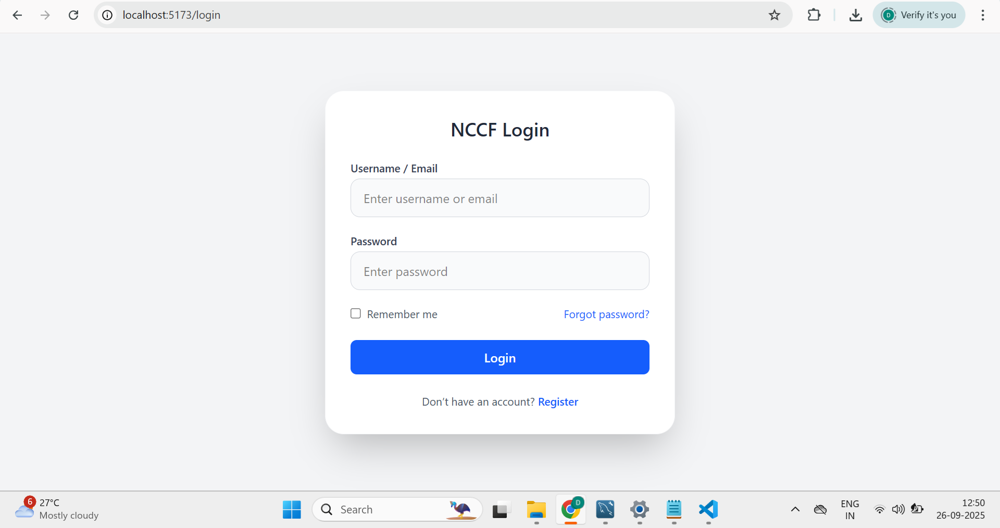
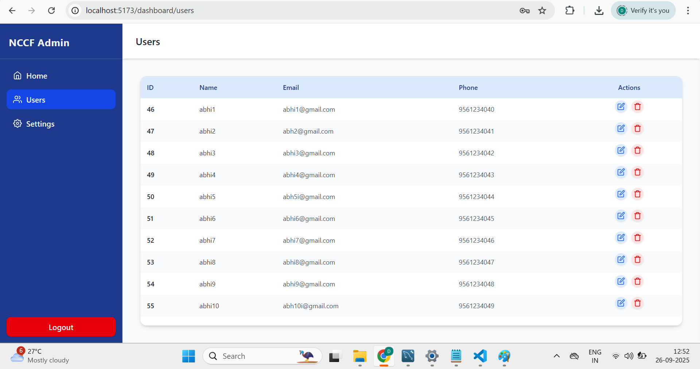
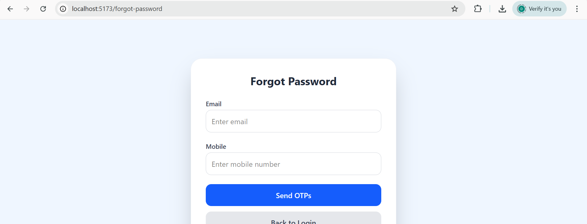
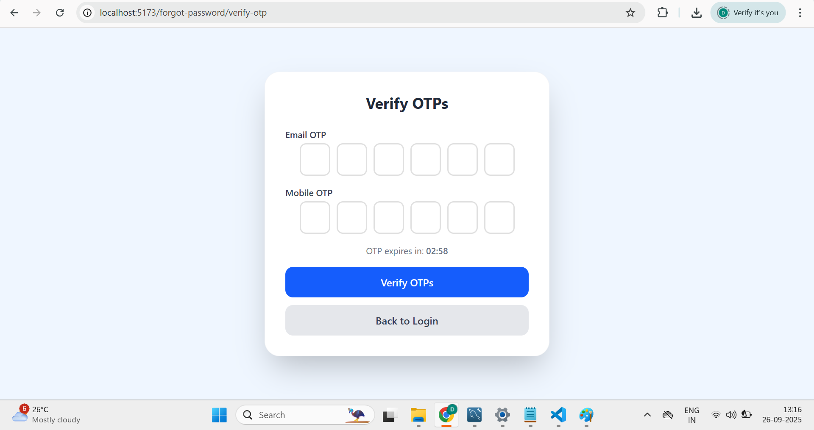
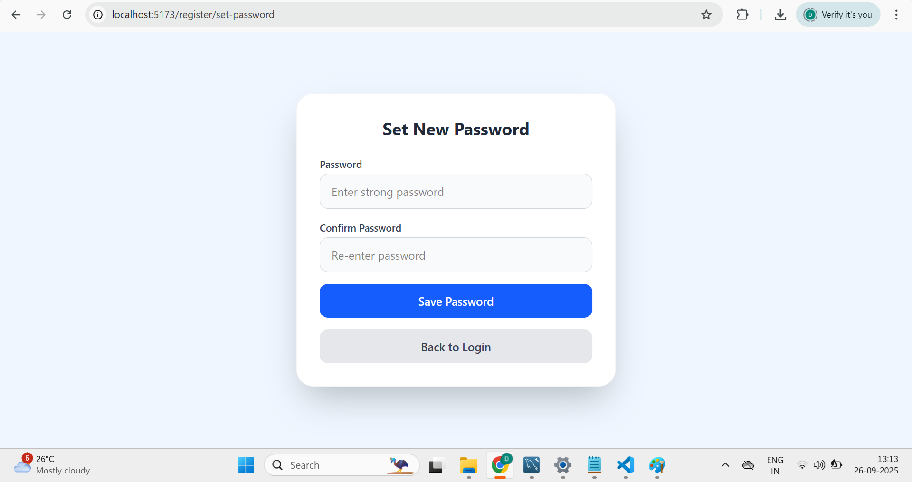
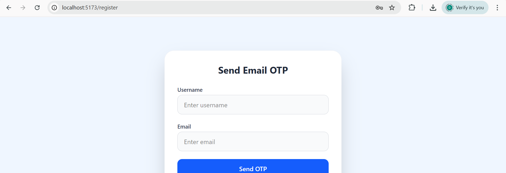
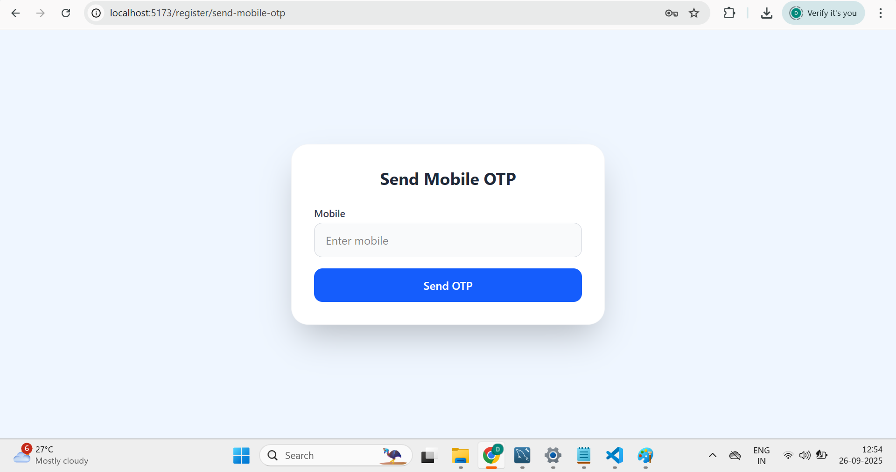
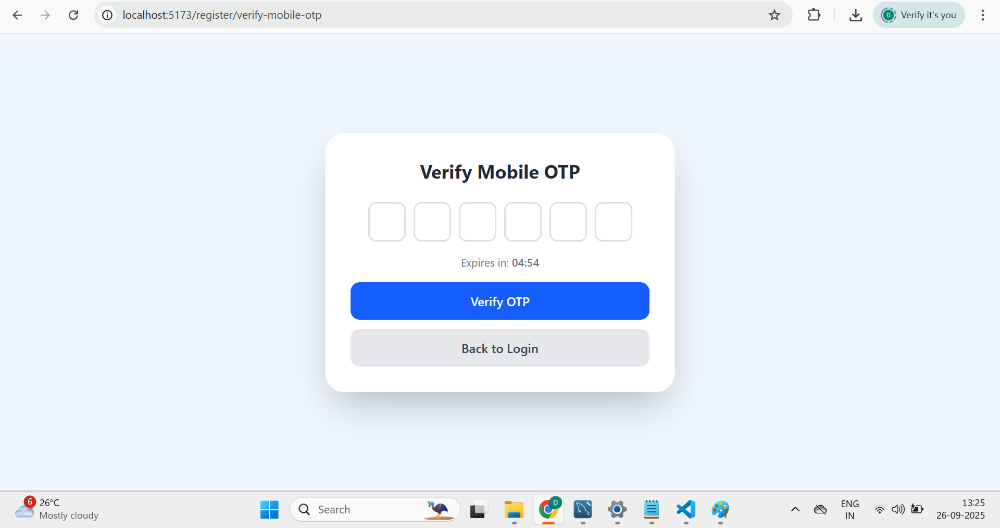

# Fullstack Authentication Project

This is a **fullstack project** built with **React (frontend)** and **FastAPI (backend)**.  
It includes JWT authentication, protected routes, and user management.
---

## 📂 Project Structure

frontend/ # React + Vite app
backend/ # FastAPI app
screenshots/ # Project screenshots
README.md

---

## Features

-  JWT Authentication (Login, Register, Logout)
-  User Management (CRUD)
-  Protected Routes (Frontend & Backend)
-  Email OTP for password reset
-  Modern UI (React + Tailwind)
-  FastAPI + SQLAlchemy backend
-  Password Format & Security
----We use **bcrypt** for password hashing to ensure strong security
---


## Getting Started

### Backend (FastAPI)

```bash
cd backend
pip install -r requirements.txt
uvicorn index:app --reload
API will run at: http://localhost:8000

---


### FrontEnd (FastAPI)
cd frontend
npm install
npm run dev
Frontend will run at: http://localhost:5173

## 📸 Screenshots

### Login Page


### Dashboard


### ForgetPassword Flow




### Registration






